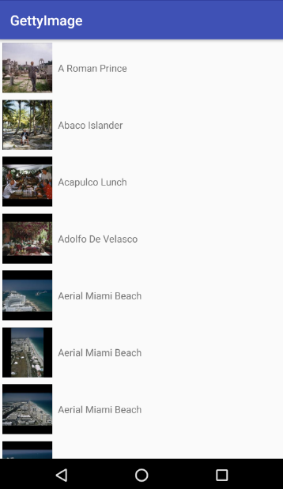

## Languages, libraries and tools used

* [Kotlin](https://kotlinlang.org/)
* Android Support Libraries
* [RxJava2](https://github.com/ReactiveX/RxJava/wiki/What's-different-in-2.0)
* [Dagger 2 (2.11)](https://github.com/google/dagger)
* [Glide (4)](https://github.com/bumptech/glide)
* [Timber](https://github.com/JakeWharton/timber)
* [Mockito](http://site.mockito.org/)
* [Spek](https://github.com/spekframework/spek)
* [Stetho](http://facebook.github.io/stetho/)
* [Android-Junit5](https://github.com/mannodermaus/android-junit5)
* [Robolectric](http://robolectric.org/)
* [Databinding](https://developer.android.com/topic/libraries/data-binding/index.html?hl=ko)
* [Kluent](https://github.com/MarkusAmshove/Kluent)
* [Jsoup](https://github.com/jhy/jsoup)

## Demos
